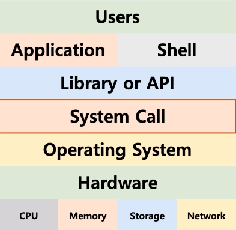

# 운영체제
> Operation System 또는 OS라고 불린다.
+ 대표적인 운영체제
  - Windows OS, Mac OS, UNIX
  - UNIX 계열 OS (UNIX와 사용법이나 OS 구조가 유사)
    - LINUX OS

## 운영체제의 역할

### 1. 시스템 자원(System Resource) 관리
> 시스템 자원 : 컴퓨터 하드웨어 (CPU(중앙처리장치), Memory(DRAM, RAM), I/O Devices(입출력장치), 저장매체(SSD, HDD))
+ CPU : 각 프로그램이 얼마나 CPU를 사용할지 결정
+ Memory : 각 프로그램이 어느 주소에 어느정도 메모리 공간을 확보해야 하는지 결정
+ 저장매체 : 어떻게, 어디에 저장할지 결정
+ I/O Devices : 입출력 장치를 표시

### 2. 사용자와 컴퓨터간의 커뮤니케이션 지원
> OS가 사용자의 명령을 전달
+ 사용자 인터페이스
  + 쉘 (Shell)
    + 사용자가 운영체제 기능과 서비스를 조작할 수 있도록 인터페이스를 제공하는 프로그램
    + CLI(터미널 환경), GUI로 구분된다.
    + 쉘도 응용 프로그램으로 API를 통해 운영체제에 요청
 
+ 응용 프로그램 인터페이스
  + 시스템 콜 (시스템 호출 인터페이스)
    > 운영체제 기능을 호출하는 함수
    + 운영체제가 운영체제 각 기능을 사용할 수 있도록 시스템 콜이라는 명령 또는 함수를 제공
    + API 내부에는 시스템 콜을 호출하는 형태로 만들어지는 경우가 대부분
  + API(Application Programming Interface)
    > 요청서의 집합, 각 언어별 운영체제 기능 호출 인터페이스 함수
    + 함수로 제공
    + 보통은 라이브러리(library) 형태로 제공  

### 3. 응용 프로그램 관리

>프로그램 = 소프트웨어   
>소프트웨어 = 운영체제, 응용 프로그램(ex: 엑셀, 파워포인트 등 ..)   
>응용프로그램 = Application(PC) = App(모바일)   

+ 응용 프로그램 실행
+ 응용 프로그램간의 권한 관리
  + 관리자 권한으로 실행
+ 응용 프로그램을 사용하는 사용자도 관리
  + 사용자 로그인

<pre>
 운영체제의 목표 : 사용자가 사용하는 응용 프로그램을 효율적으로, 적절하게 작동하도록 지원
 운영체제는 응용 프로그램이 요청하는 시스템 리소스를 효율적으로 분배하고, 지원하는 소프트웨어
</pre>

## CPU Protection Rings
> 함부로 응용 프로그램이 전체 컴퓨터 시스템을 헤치지 못하게 하기 위함
### Mode
+ 사용자 모드(user mode) : 응용 프로그램이 사용
+ 커널 모드(kernel mode) : OS가 사용
  + 커널 모드에서만 실행 가능한 기능들이 존재
  + 커널 모드를 실행하려면, 반드시 시스템 콜을 거쳐야 한다.

<pre>
  운영체제는 시스템 콜 제공
  프로그래밍 언어별로 운영체제 기능을 활용하기 위해, 시스템 콜 기반으로 API를 제공
  응용 프로그램은 운영체제 기능 필요시, 해당 API를 사용하여 프로그램을 작성
  응용 프로그램이 실행되어, 운영체제 기능이 필요한 API를 호출하면, 시스템 콜이 호출되어,    
  커널모드로 변경되어 OS 내부에서 해당 명령이 실행되고, 다시 응용 프로그램으로 돌아간다.
</pre>

## 프로세스 스케줄링

### 배치 처리 시스템
+ 큐와 유사한 시스템 처리방식 (First In First Out)
  + 먼저 실행된 응용 프로그램이 끝나야 다음 프로그램 실행
  + 동시에 여러 응용프로그램 실행 불가
  + 다중 사용자 지원 X

### 시분할 시스템 
+ 다중 사용자 지원을 위해 컴퓨터 응답시간을 최소화 하는 시스템

### 멀티 태스킹
+ 단일 CPU에서, 여러 응용 프로그램이 동시에 실행되는 것처럼 보이게 하는 시스템

### 멀티 프로세싱
+ 여러 CPU에 하나의 응용 프로그램을 병렬로 실행하여 실행속도를 극대화 시키는 시스템

### 멀티 프로그래밍
+ 최대한 CPU를 일정 시간동안 많이 활용하도록 하는 시스템

<pre>
  실제로 시분할 시스템, 멀티 프로그래밍, 멀티 태스킹이 유사한 의미로 통용
</pre>

## 프로세스(process)
> 작업, task, job이라는 용어와 혼용
+ 메모리에 올려져서, 실행중인 프로그램
+ 코드 이미지(바이너리) 실행파일
+ 프로세스 != 응용 프로그램
  + 하나의 응용 프로그램은 여러 개의 프로세스(프로그램)가 상호작용을 하면서 실행될 수도 있음
  + 여러 프로그램을 만들어서, 서로 통신하면서 프로그램을 작성할 수도 있음 (IPC 기법)
+ 상태
  + new : 프로세스 생성
  + running state : 현재 CPU에서 실행 상태
  + ready state : CPU에서 실행 가능한 상태 (실행 대기 상태)
  + block state : 특정 이벤트 발생 대기 상태
  + exit : 종료
+ 구조
  + stack : 임시데이터 (함수 호출, 로컬 변수 등)
  + heap : 코드에서 동적으로 만들어지는 데이터 (동적 할당)
  + data : 변수 / 초기화된 데이터
    + BSS : 초기값이 없는 전역변수
    + DATA : 초기값이 있는 전역변수
  + text(CODE) : 코드

### 스케줄러
+ 프로세스 실행을 관리

### 스케줄링 알고리즘(정책)
> 프로세스가 저장매체를 읽는 다든지, 프린팅을 한다든지 하는 작업 없이 쭉 CPU를 처음부터 끝까지 사용한다 가정.

#### FIFO 스케줄러 (First In, First Out : FIFO)
+ 가장 간단한 스케줄러 (배치 처리 시스템) 
+ FCFS (First Come First Served) 스케줄러

#### 최단 작업 우선 스케줄러 (Shoest Job First : SJF)
+ 프로세스 실행 시간이 가장 짧은 프로세스부터 먼저 실행 

#### 우선순위 기반 스케줄러 (Priority)
+ 우선순위에 따라 프로세스 실행
  + 정적 우선순위
    + 프로세스마다 우선순위를 미리 지정
  + 동적 우선순위
    + 스케줄러가 상황에 따라 우선순위를 동적으로 변경

#### Round Robin 스케줄러 (RR)
+ 시분할 시스템을 위해 고안된 선점 스케줄링
+ 프로세스가 시간이 만료될 때까지 처리를 완료하지 못하면 대기 중인 다음 프로세스가 실행되고 실행 중이던 프로세스는 작업 큐의 가장 뒤로 보내진다.
 
#### 선점형 스케줄러 (Preemptive Scheduling) :   
+ 한 프로세스가 CPU를 할당받아 실행 중이라도 다른 프로세스가 현재 프로세스를 중지시키고 CPU를 강제적으로 뺏을 수 있는 방식
+ RoundRobin(RR)

#### 비선점 스케줄러 (Non-preemptive Scheduling) :    
+ 한 프로세스가 CPU를 할당받아 실행 중이면 다른 프로세스들이 CPU를 강제로 뻇을 수 없는 방식
+ FIFO(FCFS), SJF, Priority

## 인터럽트
> 일종의 이벤트로 불림   
> 이벤트에 맞게 운영체제가 처리
+ CPU가 프로그램을 실행하고 있을 때, 입출력 하드웨어 등의 장치나 또는 예외상황이 발생하여 처리가 필요할 경우 CPU에 알려서 처리하는 기술
+ 인터럽트의 역할
  + 선점형 스케줄러 구현
    + 프로세스 running 중에 스케줄러가 이를 중단시키고, 다른 프로세스로 교체하기 위해 현재 프로세스를 중단
  + I/O Device와의 커뮤니케이션
    + 저장매체에서 데이터 처리 완료시, 프로세스를 깨움 (Block state -> Ready state) 
  + 예외 상황 핸들링
    + CPU가 프로그램을 실행하고 있을 때, 입출력 하드웨어 등의 장치나 또는 예외상황이 발생할 경우, CPU가 해당 처리를 할수 있도록 알림 
+ 인터럽트 종류
  + 내부 인터럽트 (소프트웨어 인터럽트)
    > 주요 프로그램 내부에서 잘못된 명령 또는 잘못된 데이터 사용시 발생
    + 계산하는 코드에서 0으로 나누는 코드 실행시 (Divide-by-Zero Interrupt)
    + 사용자 모드에서 허용되지 않은 명령 또는 공간 접근시
    + 계산 결과가 Overflow 또는 Underflow가 발생할 때
  + 외부 인터럽트 (하드웨어 인터럽트)
    > 주로 하드웨어에서 발생되는 이벤트
    + 전원 이상
    + 기계 문제
    + 타이머 인터럽트 (선점형 스케줄러를 위해 필요)
    + 입출력(I/O) 인터럽트

### 인터럽트와 시스템 콜
  + 시스템 콜 인터럽트 명령을 호출하면서 0x80값을 넘겨줌
  + CPU는 사용자 모드를 커널모드로 바꿔줌
  + IDT(Interrupt Descriptor Table)에서 0x80에 해당하는 주소(함수)를 찾아 실행
  + system_call()함수에서 eax로부터 시스템 콜 번호를 찾아서, 해당 번호에 맞는 시스템 콜 함수로 이동
  + 해당 시스템 콜 함수를 실행 후, 다시 커널 모드에서 사용자 모드로 변경하고, 다시 프로세스 다음 코드 진행

### 인터럽트와 IDT
  + 인터럽트는 미리 정의되어 각각 번호와 실행 코드를 가리키는 주소가 기록되어 있음 (IDT에 부팅시 운영체제가 기록) 

### 인터럽트와 프로세스
  + 프로세스 실행 중 인터럽트 발생
  + 현재 프로세스 중단
  + 인터럽트 처리 함수 실행(운영체제)
  + 프로세스 재실행

## 컨택스트 스위칭 (Context Switching : 문맥 교환)
  + CPU에 실행할 프로세스를 교체하는 기술
  + 과정 
    1. 실행 중지할 프로세스 정보를 해당 프로세스의 PCB에 업데이트 해서, 메인 메모리에 저장
    2. 다음 실행할 프로세스 정보를 메인 메모리에 있는 해당 PCB 정보(PC:Program Count, SP:Stack Pointer)를 메인메모리에서 로드해서 CPU의 레지스터에 넣고 실행      
    +  PCB(Process Control Block) : 프로세스 상태정보 저장
        + Process ID
        + Register 값(PC, SP등)
        + Scheduling Info
        + Memory Info(메모리 사이즈 limit)    
    + 디스패치 (dispatch) : ready 상태의 프로세스를 running 상태로 바꾸는 것

## IPC (InterProcess Communication : 프로세스간 커뮤니케이션)
+ 여러 프로세스 동시 실행을 통한 성능 개선, 복잡한 프로그램을 위해 프로세스간 통신 필요
+ 프로세스간 공간이 완전 분리

> 참고
+ IPC 기법
  + file 사용 (파일을 읽어야 함으로, 실시간으로 데이터 전달이 어려움)
  + Message Queue
    + FIFO 정책으로 데이터 전송
    + 어느 프로세스간이라도 데이터 송수신 가능
  + Shared Memory
    + kernel space에 메모리 공간을 만들고, 해당 공간을 변수처럼 쓰는 방식
    + 해당 메모리 주소를 마치 변수처럼 접근하는 방식
    + 공유 메모리 key를 가지고, 여러 프로세스가 접근 가능
  + Pipe
    + 기본 파이프는 단방향 통신
    + fork()로 자식 프로세스를 만들었을 때, 부모와 자식간의 통신
  + Semaphore
  + Signal
    + 커널 또는 프로세스에서 다른 프로세스에 어떤 이벤트가 발생되었는지를 알려주는 기법
    + PCB에 해당 프로세스가 블록 또는 처리해야하는 시그널 관련 정보 관리
      + 커널모드 -> 사용자모드 전환시 시그널 처리
  + Socket
    + 네트워크 통신을 위한 기술
    + 기본적으로는 클라이언트와 서버등 두 개의 다른 컴퓨터간의 네트워크 기반 통신을 위한 기술
    + 소켓을 하나의 컴퓨터 안에서, 두개의 프로세스간에 통신 기법으로 사용 가능
  > file 기법을 제외한 나머지는 커널 공간 사용

## Thread(스레드)
+ Light Weight Process 라고도 함
+ 프로세스 vs 스레드
  + 프로세스
    + 프로세스 간에는 각 프로세스의 데이터 접근이 불가 (IPC를 이용하여 데이터 통신)
  + 스레드
    + 하나의 프로세스에 여러개의 스레드 생성 가능
    + 스레드들은 동시에 실행 가능
    + 프로세스 안에 있으므로, 프로세스의 데이터를 모두 접근 가능
+ Multi Thread(멀티 스레드)
  + 소프트웨어 병행 작업 처리를 위해 Multi Thread를 사용
+ 장점
  + 사용자에 대한 응답성 향상
  + 성능 개선 가능
  + 자원 공유 효율
    + IPC 기법과 같이 프로세스간 자원 공유를 위해 번거로운 작업이 필요없음
    + 프로세스 안에 있으므로, 프로세스의 데이터를 모두 접근 가능
  + 작업이 분리되어 코드가 간결
+ 단점
  + 스레드 중 한 스레드만 문제가 있어도, 전체 프로세스가 영향을 받음
  + 스레드를 많이 생성하면, Context Switching이 많이 일어나, 성능 저하
  > 리눅스 OS에서는 Thread를 Process와 같이 다룸 -> 스레드를 많이 생성하면 모든 스레드를 스케쥴링 해야하므로, Context Switching이 빈번할 수 밖에 없음 
+ Thread vs Process
  + 프로세스는 독립적, 스레드는 프로세스의 서브셋
  + 프로세스는 각각 독립적인 자원을 가짐, 스레드는 프로세스 자원공유
  + 프로세스는 자신만의 주소영역을 가짐, 스레드는 주소영역 공유
  + 프로세스간에는 IPC기법으로 통신, 스레드는 동일 프로세스 내의 데이터 모두 접근가능
+ PThread
  + POSIX 스레드(Thread 관련 표준 API)
+ 동기화(Synchronization) 이슈
  + 동기화 : 작업들 사이에 실행 시기를 맞추는 것
  + 여러 스레드가 동일한 자원(데이터)에 접근시 동기화 이슈 발생
    + 동일 자원을 여러 스레드가 동시 수정시, 각 스레드 결과에 영향을 줌
  + 해결 방안
    + Mutual exclusion(상호 배제)
    + 세마포어
      + Critical Section(임계 구역)에 대한 접근을 막기 위해 LOCKING매커니즘이 필요
      + Mutex(binary semaphore)
        + 임계구역에 하나의 스레드만 들어갈 수 있음
      + Semaphore
        + 임계구역에 여러 스레드가 들어갈 수 있음
        + counter를 두어서 동시에 리소스에 접근 할 수 있는 허용 가능한 스레드 수를 제어
        + P : 검사 (임계영역에 들어갈 때)
          + S값이 1이상이면, 임계 영역 진입 후, S값 1 차감(S 값이 0이면 대기)
        + V : 증가 (임계영역에 나올 때)
          + S값을 1 더하고, 임계 영역을 나옴
        + S : 세마포어 값(초기 값만큼 여러 프로세스가 동시 임계 영역 접근 가능)

## deadlock (교착상태)
+ 무한 대기 상태 : 두 개 이상의 작업이 서로 상대방의 작업이 끝나기 만을 기다리고 있기 때문에, 다음 단계로 진행하지 못하는 상태
+ 교착상태 발생 조건
> 다음 네 가지 조건이 모두 성립될 때, 교착상태 발생 가능성이 있음 -> 이 중 하나라도 해당 되지 않으면 발생 x
  + 상호배제 (Mutual exclusion) : 프로세스들이 필요로 하는 자원에 대해 배타적인 통제권을 요구한다
  + 점유대기 (Hold and wait) : 프로세스가 할당된 자원을 가진 상태에서 다른 자원을 기다린다
  + 비선점 (No preemption) : 프로세스가 어떤 자원을 사용을 끝낼 때까지 그 자원을 뻇을 수 없다
  + 순환대기 (Circular wait) : 각 프로세스는 순환적으로 다음 프로세스가 요구하는 자원을 가지고 있다 
+ starvation (기아 상태)
  + 특정 프로세스의 우선순위가 낮아서 원하는 자원을 계속 할당 받지 못하는 상태
  + 교착상태와 기아상태
    + 교착상태는 여러 프로세스가 동일 자원 점유를 요철할 때 발생
    + 기아상태는 여러 프로세스가 부족한 자원을 점유하기 위해 경쟁할 때, 특정 프로세스는 영원히 자원 할당이 안되는 경우를 주로 의미함
  + 해결방안 
    + 프로세스 우선순위를 수시로 변경

## 가상 메모리 (Virtual Memory System)
+ 메모리가 실제 메모리보다 많아 보이게 하는 기술
  + 실제 사용하는 메모리는 작다는 점에서 착안한 기술
  + 프로세스간 공간 분리로, 프로세스 이슈가 전체 시스템에 영향을 주지 않을 수 있음
+ 실제 각 프로세스마다 충분한 메모리를 할당하기에는 메모리의 크기가 한계가 있음
+ 폰노이만 구조 기반이므로, 코드는 메모리에 반드시 있어야함
+ 필요이유
  + 하나의 프로세스만 실행 가능한 시스템(배치 처리 시스템 등)
    + 프로그램 메모리로 로드
    + 프로세스 실행
    + 프로세스 종료 (메모리 해제)
  + 여러 프로세스 동시 실행 시스템
    + 메모리 용량 부족 이슈
    + 프로세스 메모리 영역간에 침범 이슈
+ 기본 아이디어
  + 프로세스는 가장 주소를 사용하고, 실제 해당 주소에서 데이터를 읽고/ 쓸때만 물리 주소로 바꿔주면 된다.
  + virtual address (가상 주소) : 프로세스가 참조하는 주소
  + physical address (물리 주소) : 실제 메모리 주소
+ MMU (Memory Management Unit)
  + CPU에 코드 실행시, 가상 주소 메모리 접근이 필요할 때, 해당 주소를 물리 주소값으로 변환해주는 하드웨어 장치
  + CPU는 가상메모리를 다루고, 실제 해당 주소 접근시 MMU 하드웨어 장치를 통해 물리 메모리 접근
+ TLB (Translation Lookaside Buffer)
  + 페이지 정보 캐쉬

### 페이징 시스템 (Paging System)
+ 페이징(paging) 개념
  + 크기가 동일한 페이지로 가상 주소 공간과 이에 매칭하는 물리 주소 공간을 관리
  + 하드웨어 지원이 필요
  + 리눅스에서 4KB로 paging
  + 페이지 번호를 기반으로 가상 주소/물리 주소 매핑 정보를 기록/사용
+ 구조
  + page 또는 page frame : 고정된 크기의 block(4KB)
  + 가상 주소 v = (p, d)
    + p: 가상 메모리 페이지
    + d: p안에 참조하는 위치
    + 페이지 크기가 4KB 예
      + 가상 주소의 0비트에서 11비트가 변위 (d)를 나타내고
      + 12 비트 이상이 페이지 번호가 될 수 있음

   
      
+ Page Table
  + 물리 주소에 있는 페이지 번호와 해당 페이지의 첫 물리 주소 정보를 매핑한 표
  + 프로세스(4GB)의 PCB에 Page Table 구조체를 가리키는 주소가 들어 있음
+ 동작
  + 해당 프로세스의 page table에 해당 가상 주소가 포함된 page번호가 있는지 확인
  + page 번호가 있으면 이 page가 매핑된 첫 물리주소를 알아내고 (p')
  + p' + d 가 실제 물리 주소가 됨

+ 프로세스 생성시, 페이지 테이블 정보 생성
  + PCB등에서 해당 페이지 테이블 접근 가능하고, 관련 정보는 물리 메모리에 적재
  + 프로세스 구동시, 해당 페이지 테이블 base 주소가 별도 레지스터에 저장 (CR3)
  + CPU가 가상 주소 접근시, MMU가 페이지 테이블 base 주소를 접근해서, 물리 주소를 가져옴
 
+ 공유 메모리
  + 프로세스간 동일한 물리 주소를 가리킬 수 있음(공간절약, 메모리 할당 시간 절약)
  + 물리주소 데이터 수정 시도시, 물리주소를 복사 (copy-on-write)
  
+ 다중 단계 페이징 시스템
  + 32bit 시스템에서 4KB 페이지를 위한 페이징 시스템은
    + 하위 12bit는 오프셋
    + 상위 20bit 페이징 번호이므로, 2^20 개의 페이지 정보가 필요함
  + 페이징 정보를 단계를 나누어 생성
    + 필요없는 페이지는 생성하지 않으면 공간 절약 가능

+ 요구 페이징 (Demand Paging)
  + 프로세스 모든 데이터를 메모리로 적재하지 않고, 실행 중 필요한 시점에서만 메모리로 적재함
    + 선행 페이징 (Anticipatory Paging)의 반대개념 : 미리 프로세스 관련 모든 데이터를 메모리에 올려놓고 실행
    + 더이상 필요하지 않은 페이지 프레임은 다시 저장매체에 저장 (페이지 교체 알고리즘 필요)
  + 페이지 폴트 (Page Fault) 인터럽트
    + 어떤 페이지가 실제 물리 메모리에 없을 때 일어나는 인터럽트
    + 운영체제가 page fault가 일어나면, 해당 페이지를 물리 메모리에 올림
    + 페이지 폴트가 자주 일어나면 해당 페이지를 물리 메모리에 올려야 함으로 시간이 오래 걸림
    
#### 페이지 교체 정책
> 운영체제가 특정 페이지를 물리 메모리에 올리려 하는데, 물리 메모리가 다 차있다면 -> 기존 페이지 중 하나를 물리 메모리에서 저장 매체로 내리고(저장) -> 새로운 페이지를 해당 물리 메모리 공간에 올린다
1. FIFO (First In First Out)
   + 가장 먼저 들어온 페이지를 교체
2. OPT (OPTimal replacement)
   + 앞으로 가장 오랫동안 사용하지 않을 페이지를 교체
   + 구현 불가
3. LRU (Least Recently Used)
   + 가장 오래 전에 사용된 페이지를 교체
4. LFU (Least Frequently Used)
   + 가장 적게 사용된 페이지를 교체
5. NUR(Not Used Recently)
   + LRU와 마찬가지로 최근에 사용하지 않은 페이지부터 교체
   + 각 페이지마다 참조 비트(R), 수정 비트(M)을 둠 (R,M)
   + (0,0), (0,1), (1,0), (1,1) 순으로 페이지 교체

## 스레싱 (Thrashing)
+ 반복적으로 페이지 폴트가 발생해서, 과도하게 페이지 교체 작업이 일어나, 실제로는 아무일도 하지 못하는 상황

### 세그멘테이션 기법
+ 가상 메모리를 서로 크기가 다른 논리적 단위인 세그먼트로 분할
  + 페이징 기법에서는 가상 메모리를 같은 크기의 블록으로 분할
+ 세그먼트 가상주소
  + v = (s, d) : s는 세그먼트 번호, d는 블록 내 세그먼트의 변위

> 참고
  + 내부 단편화 (페이지 기법)
    + 페이지 블록만큼 데이터가 딱 맞게 채워져 있지 않을 때 공간낭비
  + 외부 단편화 (세그멘테이션 기법)
    + 물리 메모리가 원하는 연속된 크기의 메모리를 제공해주지 못하는 경우
  + 세그멘테이션/페이징 모두 하드웨어 지원 필요
    + 다양한 컴퓨터 시스템에 이식성을 중요시하는 리눅스는 페이징 기법을 기반으로 구현

## 파일 시스템
+ 운영체제가 저장매체에 파일을 쓰기 위한 자료구조 또는 알고리즘
+ 저장매체에 효율적으로 파일을 저장하는 방법
  + 가능한 연속적인 공간에 파일을 저장하는 것이 좋음
  + 외부 단편화, 파일 사이즈 변경 문제로 불연속 공간에 파일 저장 기능 지원 필요
    + 블록 체인: 블록을 링크드 리스트로 연결
      + 끝에 있는 블록을 찾으려면, 맨 처음 블록부터 주소를 따라가야함
    + 인덱스 블록 기법: 각 블록에 대한 위치 정보를 기록해서, 한번에 끝 블록을 찾아갈 수 있도록 함
+ 다양한 파일 시스템 
  + Windows : FAT, FAT32, NTFS
    + 블록 위치를 FAT라는 자료구조에 기록
  + 리눅스(UNIX): ext2, ext3, ext4
    + 일종의 인덱스 블록 기법인 inode 방식 사용

### inode 방식 파일 시스템
+ 파일 시스템 기본 구조
  + 수퍼 블록 : 파일 시스템 정보 및 파티션 정보 포함
  + 아이노드 블록 : 파일 상세 정보
  + 데이터 블록 : 실제 데이터
+ inode와 파일
  + 파일 : inode 고유값과 자료구조에 의해 주요 정보 관리
    + '파일이름:inode'로 파일이름은 inode번호와 매칭
    + 파일 시스템에서는 inode를 기반으로 파일 엑세스
    + inode 기반 메타 데이터 저장 (파일권한, 소유자 정보, 파일 사이즈, 생성시간 등 시간 관련 정보, 데이터 저장 위치등)      

> inode 구조와 파일 데이터    

 
### 디렉토리 엔트리
+ 리눅스 파일 탐색 : ex - /home/ubuntu/link.txt
  + 각 디렉토리 엔트리(dentry)를 탐색
    + 각 엔트리에는 해당 디렉토리 파일/디렉토리 정보를 가지고 있음
  + '/'dentry에서 'home'을 찾고, 'home'에서 'ubuntu'를 찾고, 'ubuntu'에서 'link.txt'파일 이름에 해당하는 inode를 얻음

### 가상 파일 시스템 (Virtual File System)
+ Network등 다양한 기기도 동일한 파일 시스템 인터페이스를 통해 관리 가능

> 참고   
+ 리눅스(유닉스) 운영체제와 가상 파일 시스템
  + 모든 것은 파일이라는 철학을 따름
    + 모든 인터렉션은 파일을 읽고, 쓰는 것처럼 이루어져있음
    + 마우스, 키보드와 같은 모든 디바이스 관련된 기술도 파일과 같이 다루어짐
    + 모든 자원에 대한 추상화 인터페이스로 파일 인터페이스를 활용
+ 특수 파일
  + 블록 디바이스 (Block Device)
    + HDD, CD/DVD와 같이 블록 또는 섹터 등 정해진 단위로 데이터 전송, IO송수신 속도가 높음
  + 캐릭터 디바이스 (Character Device)
    + 키보드, 마우스 등 byte 단위 데이터 전송, IO 송수신 속도가 낮음
  + cd /dev, cat tty   
  
  
 

## Boot
+ 컴퓨터를 켜서 동작시키는 절차
+ Boot 프로그램
  + 운영체제 커널을 Storage에서 특정 주소의 물리 메모리로 복사하고 커널의 처음 실행 위치로 PC를 가져다 놓는 프로그램
+ 부팅 과정
  + BIOS가 특정 Storage 읽어와 bootstrap loader를 메모리에 올리고 실행
  + bootstrap loader 프로그램이 있는 곳을 찾아서 실행시킴
  
 

 
## 가상머신(Virtual Machine)
+ 하나의 하드웨어 (CPU, Memory등)에 다수의 운영체제를 설치하고, 개별 컴퓨터처럼 동작하도록 하는 프로그램
+ Virtual Machine Type1(native 또는 bare metal)   
  + 하이퍼 바이저(또는 VMM) : 운영체제와 응용프로그램을 물리적 하드웨어에서 분리하는 프로세스
  + 하이퍼 바이저 또는 버추얼 머신 모니터 (VMM)라고 하는 소프트웨어가 Hardware에서 직접 구동 (Xen, KVM)
  + KVM : AWS(아마존 클라우드 컴퓨팅 시스템) 등에서 사용
+ Virtual Machine Type2
  + 하이퍼 바이저 또는 버추얼 머신 모니터 (VMM)라고 하는 소프트웨어가 HOST OS 상위에 설치 (VMWare, Parallels Desktop (Mac))
  + VMWare : 대중적인 가상머신 프로그램
+ Full Virtualization(전가상화) VS Half Virtualization(반가상화)
  + 전가상화 : 각 가상머신이 하이퍼바이저를 통해서 하드웨어와 통신
    + 하이퍼바이저가 마치 하드웨어인 것처럼 동작하므로, 가상머신의 OS는 자신이 가상 머신인 상태인지를 모름
  + 반가상화 : 각 가상머신에서 직접 하드웨어와 통신
    + 각 가상머신에 설치되는 OS는 가상 머신인 경우, 이를 인지하고, 각 명령에 하이퍼바이저 명령을 추가해서 하드웨어와 통신
+ 또 다른 가상 머신 : Docker
  > 가상머신은 컴퓨터 하드웨어를 가상화(하드웨어 전체 추상화) ->  하이퍼바이저 사용, 추가 OS필요 등 성능 저하 이슈 존재    
  + Docker는 운영체제 레벨에서 별도로 분리된 실행환경을 제공(커널 추상화)
    + 마치 리눅스 처음 설치했을때와 유사한 실행환경을 만들어주는 리눅스 컨테이너 기술 기반
    + 리눅스 컨테이너 기술이므로 macOS나 windows에 설치할 경우는 가상 머신 기반 제공
+ 정리
  + Bare-Metal(type1) 방식이 성능이 가장 좋음 : 하드웨어 직접 엑세스하기 때문
  + Docker는 경량 이미지로 실행환경을 통째로 백업, 실행 가능

+ 참고 
  + Java Virtual Machine
    + 가상 머신과는 다른 목적 (응용 프로그램 레벨 가상화)
    + Java 컴파일러는 CPU dependency를 가지지 않는 bytecode를 생성함
    + 이 파일을 Java Virtual Machine에서 실행
    + 각 운영체제를 위한 Java Virtual Machine 프로그램 존재
  

